# steami\_screen — Visual Report

**15 tutorials** · **15/15 PASS** (SSIM ≥ 0.85) · Generated 2026-02-19

Each card shows the SVG reference mockup alongside the Pillow simulation, with the SSIM similarity score.

<table>
  <tr>
    <td align='center' valign='top' width='50%'>
      <strong><a href='../../tutorials/01_temperature/main.py'>Temperature</a></strong>  
      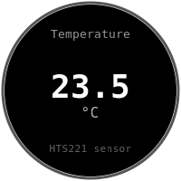&nbsp;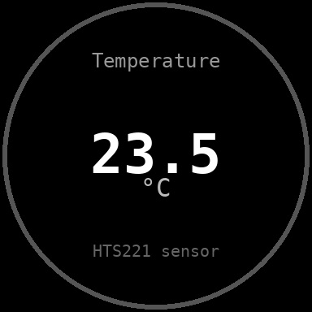 
      SVG&nbsp;reference&nbsp;&nbsp;·&nbsp;&nbsp;Simulation 
       <code>screen.value(temp, unit='C')</code> 
      Reads temperature from HTS221 sensor 
      SSIM&nbsp;0.8762&nbsp;✅
    </td>
    <td align='center' valign='top' width='50%'>
      <strong><a href='../../tutorials/02_battery/main.py'>Battery</a></strong>  
      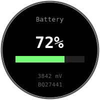&nbsp;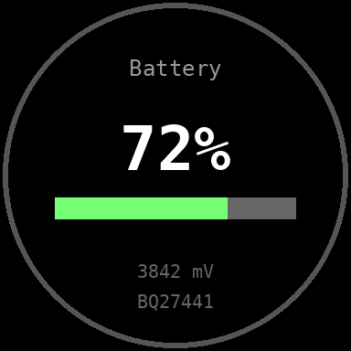 
      SVG&nbsp;reference&nbsp;&nbsp;·&nbsp;&nbsp;Simulation 
       <code>screen.bar(soc)</code> 
      Battery state of charge from BQ27441 gauge 
      SSIM&nbsp;0.9023&nbsp;✅
    </td>
  </tr>
  <tr>
    <td align='center' valign='top' width='50%'>
      <strong><a href='../../tutorials/03_comfort_dual/main.py'>Comfort (dual)</a></strong>  
      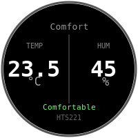&nbsp;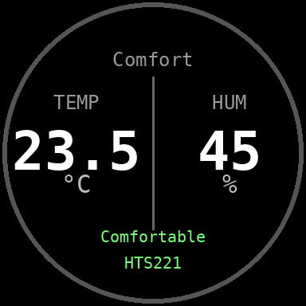 
      SVG&nbsp;reference&nbsp;&nbsp;·&nbsp;&nbsp;Simulation 
       <code>screen.value() x2</code> 
      Temperature and humidity side by side (HTS221) 
      SSIM&nbsp;0.8706&nbsp;✅
    </td>
    <td align='center' valign='top' width='50%'>
      <strong><a href='../../tutorials/04_circular_gauge/main.py'>Circular Gauge</a></strong>  
      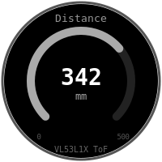&nbsp;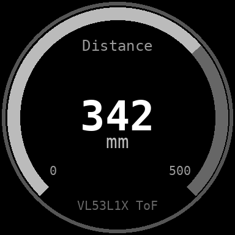 
      SVG&nbsp;reference&nbsp;&nbsp;·&nbsp;&nbsp;Simulation 
       <code>screen.gauge(dist, min_val, max_val, unit)</code> 
      Distance visualized as a circular arc gauge (VL53L1X ToF) 
      SSIM&nbsp;0.8788&nbsp;✅
    </td>
  </tr>
  <tr>
    <td align='center' valign='top' width='50%'>
      <strong><a href='../../tutorials/05_scrolling_graph/main.py'>Scrolling Graph</a></strong>  
      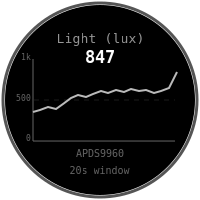&nbsp;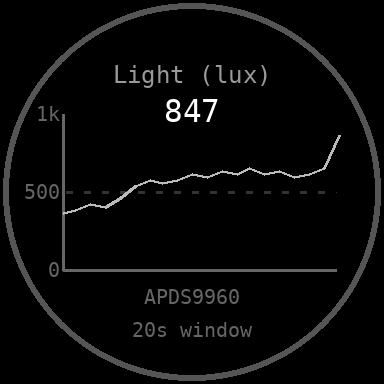 
      SVG&nbsp;reference&nbsp;&nbsp;·&nbsp;&nbsp;Simulation 
       <code>screen.graph(data, min_val, max_val)</code> 
      Light level history as a scrolling line graph (APDS9960) 
      SSIM&nbsp;0.8859&nbsp;✅
    </td>
    <td align='center' valign='top' width='50%'>
      <strong><a href='../../tutorials/06_dpad_menu/main.py'>D-pad Menu</a></strong>  
      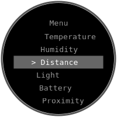&nbsp;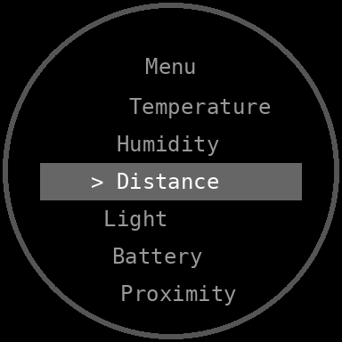 
      SVG&nbsp;reference&nbsp;&nbsp;·&nbsp;&nbsp;Simulation 
       <code>screen.menu(items, selected)</code> 
      Scrollable menu navigated with D-pad buttons (MCP23009E) 
      SSIM&nbsp;0.8671&nbsp;✅
    </td>
  </tr>
  <tr>
    <td align='center' valign='top' width='50%'>
      <strong><a href='../../tutorials/07_compass/main.py'>Compass</a></strong>  
      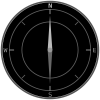&nbsp;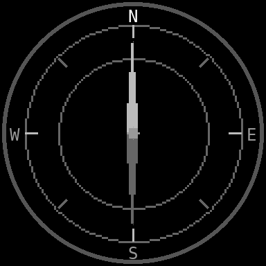 
      SVG&nbsp;reference&nbsp;&nbsp;·&nbsp;&nbsp;Simulation 
       <code>screen.compass(heading)</code> 
      Compass rose with heading needle and cardinal labels 
      SSIM&nbsp;0.8585&nbsp;✅
    </td>
    <td align='center' valign='top' width='50%'>
      <strong><a href='../../tutorials/09_watch/main.py'>Analog Watch</a></strong>  
      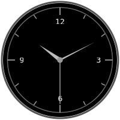&nbsp;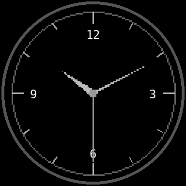 
      SVG&nbsp;reference&nbsp;&nbsp;·&nbsp;&nbsp;Simulation 
       <code>screen.watch(hours, minutes, seconds)</code> 
      Classical analog watch face with hour, minute and second hands 
      SSIM&nbsp;0.8929&nbsp;✅
    </td>
  </tr>
  <tr>
    <td align='center' valign='top' width='50%'>
      <strong><a href='../../tutorials/08_smiley_happy/main.py'>Smiley — Happy</a></strong>  
      &nbsp;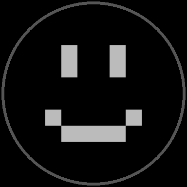 
      SVG&nbsp;reference&nbsp;&nbsp;·&nbsp;&nbsp;Simulation 
       <code>screen.face('happy')</code> 
      Full-screen happy face expression 
      SSIM&nbsp;0.9879&nbsp;✅
    </td>
    <td align='center' valign='top' width='50%'>
      <strong><a href='../../tutorials/08_smiley_sad/main.py'>Smiley — Sad</a></strong>  
      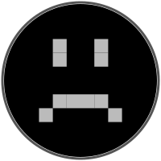&nbsp;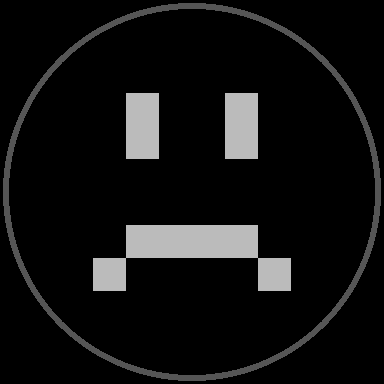 
      SVG&nbsp;reference&nbsp;&nbsp;·&nbsp;&nbsp;Simulation 
       <code>screen.face('sad')</code> 
      Full-screen sad face expression 
      SSIM&nbsp;0.9879&nbsp;✅
    </td>
  </tr>
  <tr>
    <td align='center' valign='top' width='50%'>
      <strong><a href='../../tutorials/08_smiley_surprised/main.py'>Smiley — Surprised</a></strong>  
      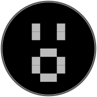&nbsp;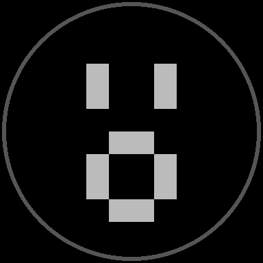 
      SVG&nbsp;reference&nbsp;&nbsp;·&nbsp;&nbsp;Simulation 
       <code>screen.face('surprised')</code> 
      Full-screen surprised face expression 
      SSIM&nbsp;0.9879&nbsp;✅
    </td>
    <td align='center' valign='top' width='50%'>
      <strong><a href='../../tutorials/08_smiley_angry/main.py'>Smiley — Angry</a></strong>  
      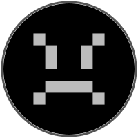&nbsp; 
      SVG&nbsp;reference&nbsp;&nbsp;·&nbsp;&nbsp;Simulation 
       <code>screen.face('angry')</code> 
      Full-screen angry face expression 
      SSIM&nbsp;0.9879&nbsp;✅
    </td>
  </tr>
  <tr>
    <td align='center' valign='top' width='50%'>
      <strong><a href='../../tutorials/08_smiley_sleeping/main.py'>Smiley — Sleeping</a></strong>  
      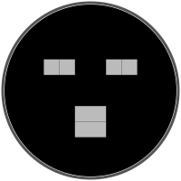&nbsp;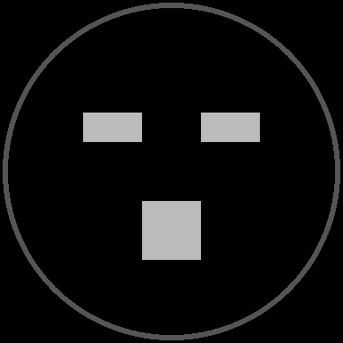 
      SVG&nbsp;reference&nbsp;&nbsp;·&nbsp;&nbsp;Simulation 
       <code>screen.face('sleeping')</code> 
      Full-screen sleeping face expression 
      SSIM&nbsp;0.9879&nbsp;✅
    </td>
    <td align='center' valign='top' width='50%'>
      <strong><a href='../../tutorials/08_smiley_love/main.py'>Smiley — Love</a></strong>  
      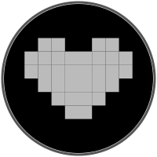&nbsp;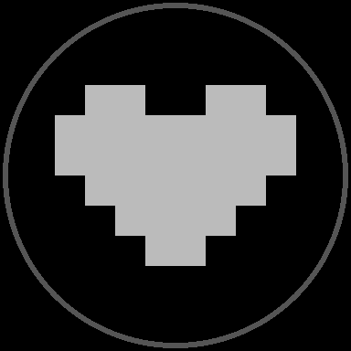 
      SVG&nbsp;reference&nbsp;&nbsp;·&nbsp;&nbsp;Simulation 
       <code>screen.face('love')</code> 
      Full-screen love face expression 
      SSIM&nbsp;0.9879&nbsp;✅
    </td>
  </tr>
  <tr>
    <td align='center' valign='top' width='50%'>
      <strong><a href='../../tutorials/08_smiley_reactive/main.py'>Smiley — Reactive</a></strong>  
      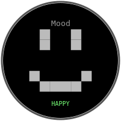&nbsp;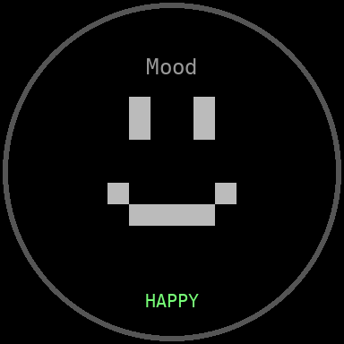 
      SVG&nbsp;reference&nbsp;&nbsp;·&nbsp;&nbsp;Simulation 
       <code>screen.face(mood, compact=True)</code> 
      Compact face with title and mood label, reactive to sensor input 
      SSIM&nbsp;0.9732&nbsp;✅
    </td>
    <td></td>
  </tr>
</table>

---
*Generated by [`generate_report.py`](../../generate_report.py)*
