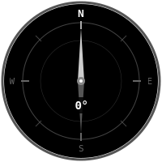

# Screen Mockups — steami_screen library

Visual mockups for the 8 example layouts using the `steami_screen` API on a round 128×128 display.

## 1. Basic Sensor — Temperature


```python
screen.title("Temperature")
screen.value(23.5, unit="°C")
screen.subtitle("HTS221 sensor")
```

## 2. Bar Gauge — Battery


```python
screen.title("Battery")
screen.value(72, unit="%")
screen.bar(72, max=100)
screen.subtitle("3842 mV")
```

## 3. Dual Value — Comfort Station


```python
screen.title("Comfort")
screen.value(23.5, unit="°C", at="W", label="TEMP")
screen.value(45, unit="%", at="E", label="HUM")
screen.subtitle("Comfortable", color=GREEN)
```

## 4. Circular Gauge — Distance


```python
screen.title("Distance")
screen.gauge(342, min=0, max=500, unit="mm")
screen.subtitle("VL53L1X ToF")
```

## 5. Scrolling Graph — Light Sensor


```python
screen.title("Light (lux)")
screen.value(847)
screen.graph(history, min=0, max=1000)
screen.subtitle("APDS9960 | 30s window")
```

## 6. D-PAD Menu — Navigation


```python
items = ["Temperature", "Humidity", "Distance", "Light", "Battery", "Proximity"]
screen.title("Menu")
screen.menu(items, selected=2)
screen.subtitle("UP/DOWN:move  A:select")
```

## 7. Smiley — Reactive Face


```python
screen.title("Reactive Smiley")
screen.icon("happy")  # or "sad", "surprised", "angry"
screen.subtitle("HAPPY", color=GREEN)
```

## 8. Compass — Magnetometer



```python
screen.title("Compass")  # hidden if gauge takes full screen
screen.compass(heading=0)
screen.text("  0°", at="CENTER")
```
